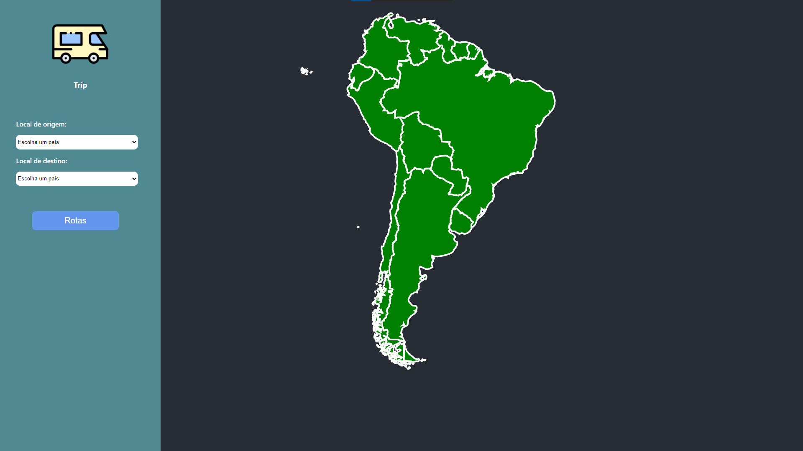

# Final trip

**Número da Lista**: 27<br>
**Conteúdo da Disciplina**: Final<br>

## Alunos
|Matrícula | Aluno |
| -- | -- |
| 16/0120918 |  Gabriel de Jesus Carvalho |
| 18/0054554  |  	Paulo Batista |

## Sobre 
Final Trip é um sistema de viagem que contêm todos os países da América do Sul,  o sistem também é responsável por calcular o menor caminho passando entre as capitais até chegar o destino final. Fora isso, para cada país visitado, o sistema também recomenda atrações turísticas baseadas na preferências do usuário.

## Screenshots



## Instalação 
**Linguagem**: Python e JavaScript<br>
**Framework**: Flask(backend) e React(frontend)<br>

Para rodar a api é necessário ter o [Python 3](https://www.python.org/) e o pip instalados e para rodar o frontend é necessário ter o [NodeJS](https://nodejs.org/en/) e o [Yarn](https://yarnpkg.com/) instalados.

Para rodar a api, entre na pasta da api, dentro da pasta do projeto e rode os seguintes comandos:

```
pip3 install -r requirements.txt
```
E depois suba o servidor rodando:
```
python3 server.py
```

Para rodar o frontend, entre na pasta frontend, dentro da pasta do projeto e rode os seguintes comandos:

```
yarn install
```

```
yarn start
``` 


## Uso 
Selecione os países que deseja viajar, clique no botão rotas, depois escolha as características que você prefere e receba as suas recomendações.

## Outros 
Para calcular o menor caminho o algoritmo Bellman-Ford é utilizado. E o cálculo da recomendação para o usuário a partir de suas preferências é feito utilizando o algoritmo de contagem de inversões.

Cada local turístico possui uma série de características que são organizadas por relevância. Algumas dessas características podem ser vistas na imagem abaixo.


